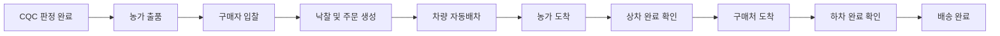
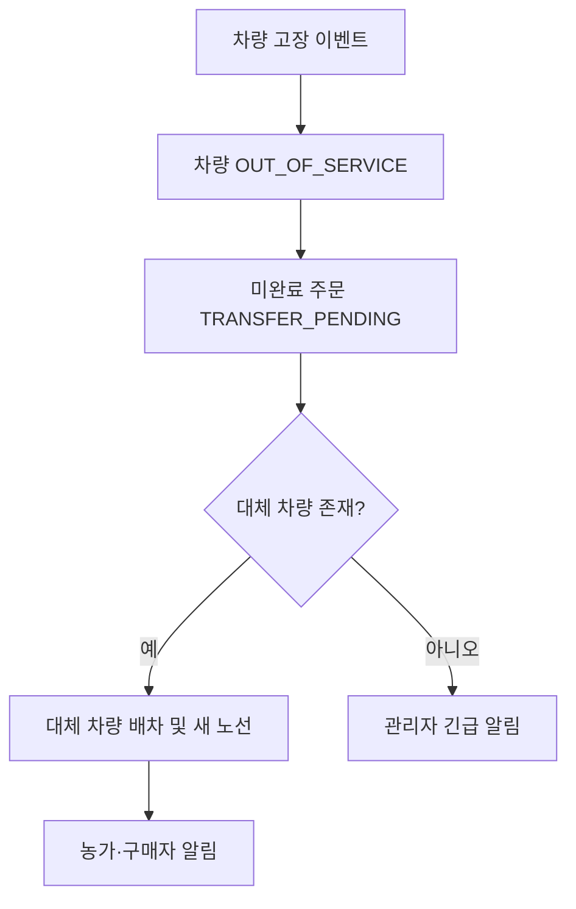

# 사용자 흐름과 상태

## 정상 흐름

## 경매 상태

`DRAFT → OPEN → CLOSED → AWARDED`

- 유효 입찰: 현재 최고가보다 높고 최저 낙찰가 이상
- 동률: 먼저 접수된 입찰 우선
- 입찰이 없으면 `CLOSED_UNSOLD`

## 주문 상태

`MATCHED → DISPATCHING → ASSIGNED → PICKUP_ARRIVED → LOADED → DELIVERY_ARRIVED → DELIVERED`

예외 상태는 `CANCELLED`, `TRANSFER_PENDING`, `FAILED`다.

## 차량 상태

`IDLE`, `TO_PICKUP`, `WAITING_LOAD`, `IN_TRANSIT`, `WAITING_UNLOAD`, `OUT_OF_SERVICE`

## 상·하차 게이트

- 차량이 픽업 지점 반경 안에 도착하면 `WAITING_LOAD`가 된다.
- 농가가 상차 완료를 누르면 적재량이 증가하고 다음 경유지로 이동한다.
- 차량이 하차 지점 반경 안에 도착하면 `WAITING_UNLOAD`가 된다.
- 구매자가 하차 완료를 누르면 적재량이 감소하고 주문이 완료된다.
- 버튼은 주문 당사자 또는 데모 관리자만 누를 수 있다고 가정한다.

## 고장 흐름

MVP에서는 실제 화물 옮김 장소를 계산하지 않고 고장 차량의 현재 좌표를 인계 지점으로 사용한다.

