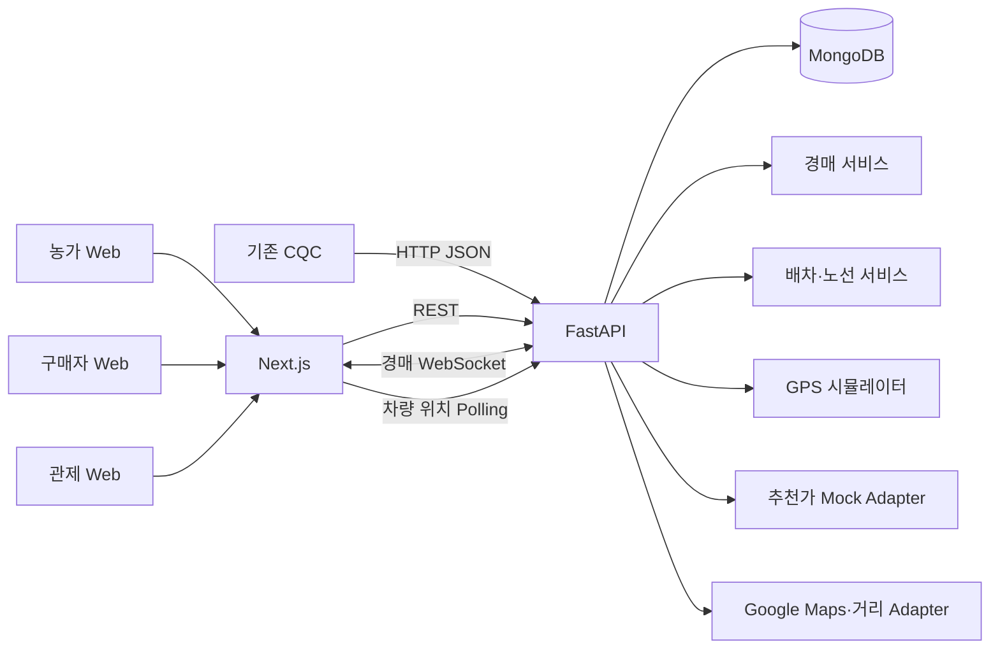

# 아키텍처



## 프로젝트 구조 목표

```text
cqc-logistics-platform/
├─ apps/
│  ├─ web/                  # Next.js
│  └─ api/                  # FastAPI
│     ├─ app/api/           # HTTP·WebSocket 진입점
│     ├─ app/domain/        # 상태, 엔티티, 정책
│     ├─ app/services/      # 경매, 배차, 노선, 예외 처리
│     ├─ app/repositories/  # MongoDB 접근
│     └─ tests/
├─ packages/
│  └─ contracts/            # OpenAPI 생성 타입 또는 공통 스키마
├─ docs/
├─ infra/
│  ├─ compose.yaml
│  └─ mongo-init/
└─ .env.example
```

## 책임 경계

- CQC는 품질 판정까지만 책임진다.
- 경매 서비스는 입찰 유효성·낙찰만 책임진다.
- 배차 서비스는 차량 후보와 최적 삽입 위치를 결정한다.
- 노선 서비스는 경유지 순서, 거리, ETA, 버전을 관리한다.
- GPS 시뮬레이터는 노선상 위치를 움직일 뿐 배차 결정을 하지 않는다.
- 지도는 Google Maps JavaScript API를 사용하고, 키가 없거나 로딩에 실패하면 안내 fallback을 보여준다.
- 거리 계산과 차량 이동 시뮬레이션은 서버 내부 계산을 유지해 지도 공급자 장애와 분리한다.

## 화면

| 경로 | 대상 | 핵심 내용 |
|---|---|---|
| `/farm` | 농가 | CQC 결과, 출품, 최저가, 상차 확인 |
| `/market` | 구매자 | 출품 목록, 상세, 입찰, 낙찰 |
| `/deliveries` | 공통 | 주문과 배송 상태 |
| `/control` | 관리자 | 지도, 차량, 노선, 경매, 장애 이벤트 |
| `/demo` | 발표자 | 시간 진행, 신규 물량, 고장 발생 버튼 |

## 운영하지 않는 것

인증은 데모 역할 전환으로 대체하고, 결제·개인정보·실제 차량 명령은 구현하지 않는다. 외부 API 키가 없어도 mock 지도 좌표와 직선 경로로 전체 데모가 돌아가야 한다.
