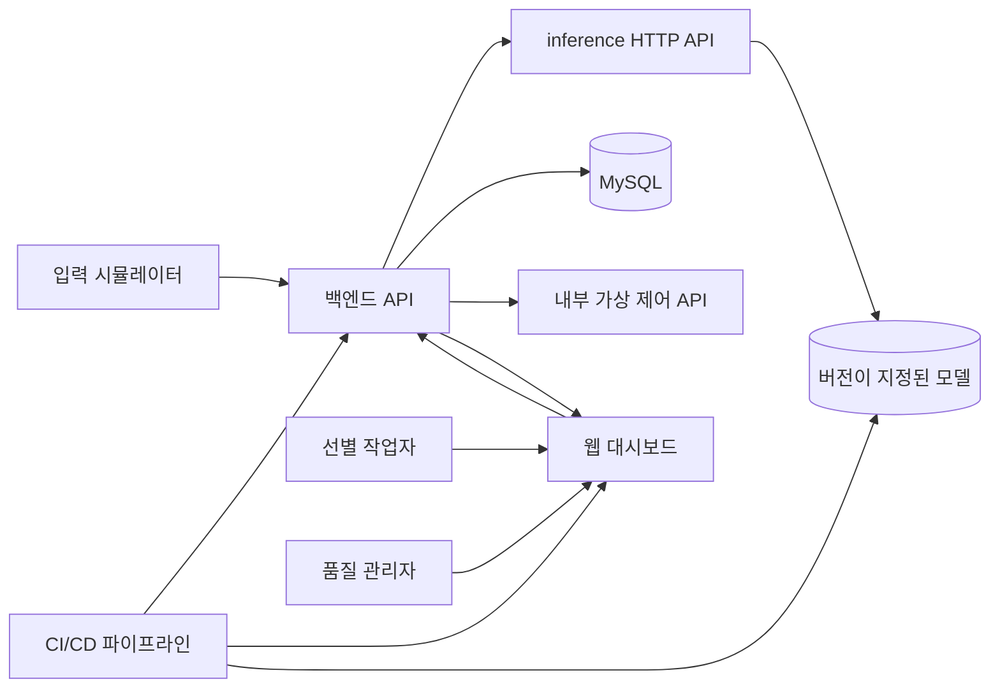
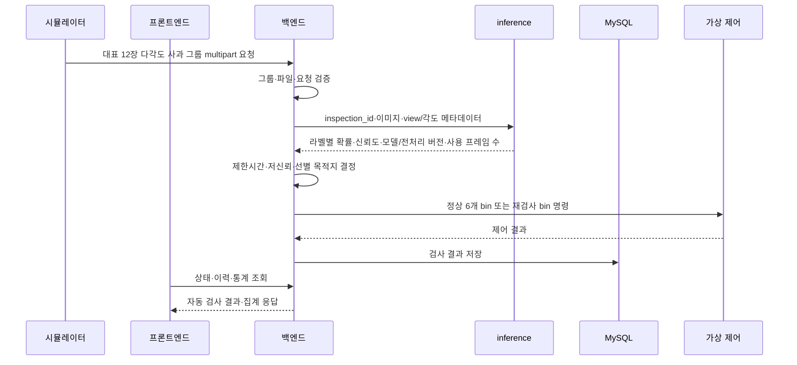
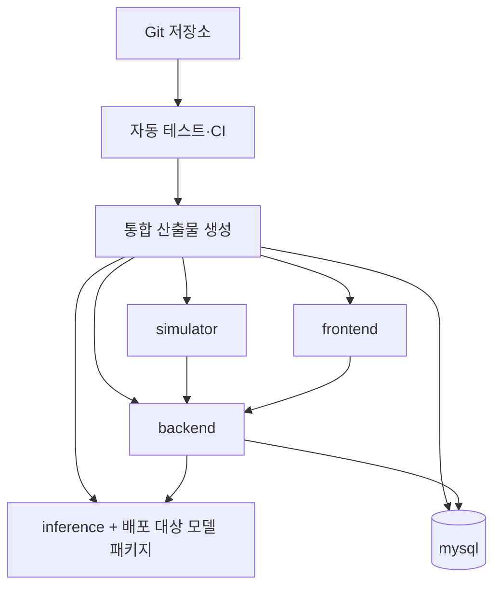

# CQC 아키텍처

## 1. 목적과 범위

CQC는 농산물 이미지를 받아 품질 등급을 예측하고, 저신뢰 검수 여부와 선별 목적지를 결정하여 MySQL에 검사 이력을 저장한다. 웹은 개별 검사 결과, 검사 이력과 통계·분석 정보를 제공한다.

현재 필수 데이터 범위는 사과 품종 2종이며 품종과 품질을 모두 판정한다. 실제 장비 연동은 범위에서 제외하고 가상 제어 API 호출을 최종 출력으로 한다.

## 2. 아키텍처 원칙

QC 이후 판매·물류는 별도 FastAPI·MongoDB·Next.js 서비스로 연결한다. MySQL은 QC 이력, MongoDB는 거래·배송 상태를 소유한다. 전체 범위와 단순 배차 원칙은 [project-plan 3.7절](./project-plan.md)을 따른다. 통합 목표는 기존 5개와 물류 3개 서비스이며 placeholder 기동은 실제 QC 통합 완료로 간주하지 않는다.

1. 학습과 서비스 추론은 같은 전처리 모듈을 사용한다.
2. 프론트엔드는 모델을 직접 호출하지 않고 백엔드 API를 사용한다.
3. 백엔드는 모델 출력에 판정 정책을 적용하고 MySQL 저장을 책임진다.
4. 모델·API·DB 계약을 문서로 먼저 합의하여 네 역할이 병렬로 작업한다.
5. 기술 스택이 확정되지 않은 영역은 논리 구성으로 정의하고 제품을 임의로 지정하지 않는다.
6. 원본 데이터, 비밀값과 대용량 모델 파일을 Git에 직접 저장하지 않는다.

## 3. 시스템 컨텍스트



## 4. 전체 처리 흐름

### 4.1 학습 흐름

```text
AI Hub 원본 이미지·라벨
  → 파일·라벨 무결성 검사
  → 사과 품종 2종 필터링
  → 동일 개체·다각도 그룹 확인
  → train·validation·test 분할
  → 전처리·증강
  → 기준선·후보 모델 학습
  → Macro F1·등급별 지표·혼동행렬 평가
  → 모델 후보와 전처리 설정 저장, 품질 기준 통과 시 승인 상태로 승격
```

### 4.2 온라인 검사 흐름



스마트폰 카메라, 사용자 이미지 파일 업로드와 실제 산업용 카메라는 사용하지 않는다. 입력 시뮬레이터가 저장된 사과 그룹에서 각도 기준으로 대표 12장을 선택하고, 사과 그룹별 multipart 요청을 500ms 간격으로 전송하며 기본 상태는 ON이다. 12장 미만 그룹은 보유 이미지를 전송하고 Inference가 누락 뷰를 masking한다. 사용자는 시연 화면에서 시작·정지할 수 있다.

입력 이미지는 목록 순서대로 사용한다. 정지는 새 입력만 차단하고 처리 중인 요청은 완료한다. 재시작하면 저장된 입력 위치부터 이어서 처리한다. 대시보드 집계는 오늘을 기본 기간으로 하며 1초마다 갱신한다.

입력 소스는 학습 데이터와 분리된 시험 이미지이며 목록 끝에서는 처음으로 돌아간다. Docker 서비스가 시작되면 웹 접속과 무관하게 자동 실행한다. Backend가 Inference 요청을 전송한 시점부터 응답 전체를 수신할 때까지 500ms를 넘으면 재검사 bin 명령을 확정하며, 이후 도착한 결과가 물리적 분류 명령을 변경할 수 없다. 병렬 처리 수는 배포 CPU 성능시험으로 정한다.

시간 초과 후 모델 결과가 도착하면 백엔드는 이를 진단 정보로 MySQL에 저장한다. 해당 결과는 확정된 재검사 bin 명령을 수정하지 않으며 정상 품종·품질 집계에서도 제외한다.

MySQL의 업무 시각은 Asia/Seoul 기준 밀리초 정밀도로 관리한다. 통계는 시간 초과 또는 시스템 오류인 건만 품종·품질 분포에서 제외하며 모든 건을 전체 검사량에 포함한다. 건수 상한 86,400건에 도달하면 오래된 8,640건을 삭제하며, 초당 2그룹 기준 실제 보존 범위는 약 10.8~12시간이다. 관리 화면의 필터 결과 전체는 별도 행 수 제한 없이 CSV로 내보낼 수 있다.

DB는 기록 계층이며 선별 판단의 필수 선행조건이 아니다. DB 장애가 발생해도 유효한 모델 결과는 정상 bin 명령으로 전달한다. 저장하지 못한 이력은 유실을 허용하며 메모리 보관분의 재시작 복구도 요구하지 않는다. Docker 재시작 후에는 볼륨의 상태 파일에 영속화된 마지막 이미지 위치부터 입력을 재개한다.

### 4.3 이력·통계 조회 흐름

```text
웹 조회 조건
  → 백엔드 요청 검증
  → MySQL 이력 검색 또는 집계
  → 페이지·통계 응답
  → 웹 표·그래프 표시
```

## 5. 논리 구성 요소

| 구성 요소 | 책임 | 담당 | 입력 | 출력 |
|---|---|---|---|---|
| 데이터 검사·가공 | 파일·라벨 검사, 정규화, 분할 | 조현재 | AI Hub 원본 | 매니페스트와 분할 목록 |
| 학습 파이프라인 | 모델 학습·평가·선정 | 조현재 | 학습 데이터 | 모델, 설정, 평가 보고서 |
| 추론 모듈 | 동일 전처리와 품종·품질 확률 반환 | 조현재 | 다각도 이미지 그룹 | 모델 예측 계약 |
| 가상 당도 모듈 | RGB 색상 특징 기반 시연값 생성과 출처 표시 | 조현재 | 다각도 이미지 그룹 | 가상 °Brix·불확실성·생성기 버전 |
| 입력 시뮬레이터 | Test 그룹 순회·500ms 간격 전송·시작/정지·위치 관리 | 홍준희 | 시험 데이터·제어 명령 | Backend 검사 요청 |
| 웹 애플리케이션 | 자동 검사 상태, 결과·이력·통계 표시 | 강성민 | API 응답·시작/정지 명령 | 사용자 화면 |
| 백엔드 API | 입력 검증, 모델 호출, 정책, 조회 | 홍준희 | 웹 요청·모델 출력 | 검사·이력·통계 응답 |
| 판정 정책 | 두 신뢰도와 제한시간으로 선별 목적지 결정 | 홍준희·조현재 | 품종·품질 확률과 처리시간 | 정상 6개 bin 또는 재검사 bin |
| MySQL | 검사 이력 저장과 집계 | 홍준희 | 검사 결과 | 이력·통계 데이터 |
| 자동 테스트·배포 | 품질 검사, 컨테이너, 배포 | 홍유나 | 코드·모델·설정 | 검증된 통합 버전 |

## 6. 역할별 경계와 소유권

| 영역 | 소유자 | 소유 범위 | 협의 대상 |
|---|---|---|---|
| 데이터·모델 | 조현재 | 데이터 매핑, 분할, 학습, 평가, 전처리·추론 모듈 | 홍준희, 홍유나 |
| 프론트엔드 | 강성민 | 검사·결과·이력·통계 화면과 API 클라이언트 | 홍준희 |
| 백엔드 | 홍준희 | FastAPI, 검사 정책, Inference HTTP Client, MySQL, Virtual Control, 조회와 Simulator 애플리케이션 로직 | 조현재, 강성민, 홍유나 |
| MLOps·CI/CD | 홍유나 | Docker·Compose·Volume·healthcheck·재시작 정책, 자동 테스트와 통합 배포 | 전체 |

## 7. 인터페이스 계약

### 7.1 모델 → 백엔드

필수 정보:

- 요청: `inspection_id`, `images[]`, 이미지별 `view_index`, `angle_direction`, `verticality_angle`, `horizontality_angle`
- 응답: 동일한 `inspection_id`
- 부사·양광 라벨을 key로 가진 확률 객체·예측·신뢰도
- `L`·`M`·`S` 라벨을 key로 가진 확률 객체·예측·신뢰도
- 추론시간, 모델명·버전과 전처리 버전
- 실제 사용 프레임 수

`group_no`, 정답 품종과 정답 품질은 모델 입력에 포함하지 않는다. 조현재는 입력 크기, 색상 공간, 정규화, 클래스 정의와 오류 조건을 함께 제공한다. 홍준희는 클래스 index 순서를 추측하지 않고 이 HTTP 계약을 호출하는 어댑터를 작성한다.

### 7.2 백엔드 → 프론트엔드

기능 단위:

- 검사 요청과 결과
- 검사 이력 검색
- 통계·분석 집계
- 서비스 상태

응답은 정상, 입력 오류, 추론 실패, DB 실패와 저신뢰 상태를 구분한다. 상세 경로와 스키마는 홍준희가 문서화하고 강성민이 검토한다.

### 7.3 백엔드 → MySQL

- 검사 ID와 처리 시각
- 품목·품종
- 예측 등급과 신뢰도
- 검수 여부와 선별 목적지
- 모델 버전
- 처리 상태와 오류 정보

물리 테이블과 인덱스는 이 문서에서 확정하지 않는다. 홍준희의 DB 설계 문서를 단일 기준으로 사용한다.

## 8. 데이터 저장

| 데이터 | 위치 | Git 포함 | 보존 목적 |
|---|---|---|---|
| AI Hub 원본 | `data/raw/` | 제외 | 원본 보존 |
| 가공 데이터 | `data/processed/` | 대용량 제외 | 재현 가능한 학습 입력 |
| 분할·설정 | `configs/` 또는 담당자가 정한 경로 | 경량 파일 포함 가능 | 학습 재현 |
| 모델 | `models/` 또는 모델 저장 위치 | 제외 | 서비스 추론 |
| 평가 결과 | `outputs/` | 선별 포함 | 모델 승인 근거 |
| 검사 이력 | MySQL | 해당 없음 | 이력·통계·분석 |

## 9. 배포 논리 구조



`yuudong123/ai-first-project`의 서비스 분리 원칙을 따라 입력 시뮬레이터, 추론 작업자와 백엔드 API를 별도 컨테이너로 분리한다. 프론트엔드는 백엔드 API만 호출한다. CQC에는 Kafka를 도입하지 않고 컨테이너 간 통신은 HTTP 기반으로 구성한다.

```text
입력 시뮬레이터
  → 백엔드 검사 API
  → inference HTTP API
  → 품종·품질 예측과 각 신뢰도
  → 백엔드 Inference HTTP 500ms·저신뢰·오류 정책
  → bin 결정·MySQL 기록·가상 제어 API
```

백엔드가 검사 단위의 오케스트레이터다. inference 서비스는 모델 추론만 담당하며 bin과 DB 정책을 알지 못한다. inference 연결 또는 호출 실패는 시스템 오류로 분류하여 재검사 bin으로 보낸다.

다각도 이미지는 Base64 JSON이 아닌 `multipart/form-data`로 전달한다. 모든 서비스와 application log는 동일한 `inspection_id`를 유지한다. 상태는 단일 값으로 합치지 않고 `inspection_status`, `control_status`, `persistence_status`와 `error_code`로 논리적으로 분리한다. 구체적인 Enum과 전이표는 API·DB 계약에서 확정한다.

가상 제어는 별도 컨테이너를 추가하지 않고 백엔드 내부 모듈과 API로 구현한다. 정상 명령이 거부되면 재검사 bin 명령을 한 번 시도한다. 제어 기능이 무응답이면 재검사 필요 상태와 전송 실패를 기록한다. 제어 응답 목표는 100ms 이내다.

사과 그룹 입력은 500ms 간격으로 한다. Inference 제한시간 500ms는 Backend가 요청을 보낸 시점부터 응답 전체를 받은 시점까지이며 Inference 측 대기·전처리·모델 실행·응답 직렬화를 포함한다. 가상 제어 응답 목표 100ms는 별도다. 개별 흐름은 약 600ms가 걸릴 수 있으므로 파이프라인을 겹쳐 초당 사과 그룹 2개를 유지하며, 실제 동시 처리 수는 CPU 시험으로 확정한다.

시연 장애 토글은 추론 시간 초과, 추론 서비스 오류, DB 연결 오류, 정상 bin 명령 거부와 가상 제어 무응답을 제공한다. 토글은 메모리 상태로만 유지하여 Docker 재시작 시 모두 OFF가 된다. 하나 이상 활성화되면 대시보드 상단에 시연 장애 경고를 표시한다.

처리 중 이미지는 백엔드 메모리의 임시 API로만 제공한다. 완료 즉시 메모리와 API 접근 대상에서 제거하고 응답에는 브라우저 캐시 금지 정책을 적용한다. 프론트엔드는 현재 진행 중인 검사 수에 따라 한 개 또는 여러 개의 이미지 카드를 표시한다. 장애 이미지는 별도 파일 저장소에 보관하며 관리 화면에서만 조회한다.

세부 기술 스택과 CI/CD 제품은 각 담당자가 선정하여 `docs/`에 기록한다. MySQL 마이그레이션은 백엔드 실행 전에 재현 가능하게 적용되어야 한다.

Compose 실행 단위는 simulator, inference, backend, frontend, mysql이다. 재시작 정책은 `unless-stopped`를 사용한다. DB와 inference 상태 확인 후 backend를 시작하고, backend 상태 확인 후 simulator와 frontend를 시작한다. inference 장애 중에도 입력은 유지하고 재검사 흐름을 실행한다.

## 10. 오류 처리

| 오류 | 처리 주체 | 기대 동작 |
|---|---|---|
| 지원하지 않는 파일 | 백엔드 | 추론 없이 입력 오류 반환 |
| 손상 이미지 | 백엔드·추론 | 원인을 구분해 오류 반환 |
| 모델 파일 누락 | 추론·MLOps | 서비스 상태 실패와 로그 기록 |
| 낮은 신뢰도 | 판정 정책 | 재검사 bin으로 보내고 이력 저장 |
| 시스템 오류 | 백엔드 | 재검사 bin 명령과 장애 이력 생성, 관련 이미지만 임시 보관 |
| 가상 제어 기능 무응답 | 백엔드 | 추가 호출 없이 재검사 필요와 전송 실패 기록 |
| 정상 bin 명령 거부 | 백엔드 제어 모듈 | 재검사 bin 명령을 한 번 시도하고 두 결과 기록 |
| 제어 기능 무응답 | 백엔드 제어 모듈 | 재검사 필요·전송 실패 기록, 성공 bin 기록 금지 |
| Inference 제한시간 초과 | 백엔드 | 요청 전송부터 응답 전체 수신까지 500ms를 넘기면 해당 사과를 재검사 bin으로 처리 |
| 시간 초과 후 결과 도착 | 백엔드 | 진단 결과 저장, bin 명령 유지, 정상 품종·품질 통계 제외 |
| MySQL 연결 실패 | 백엔드 | 저장 실패를 숨기지 않고 오류 처리 |
| MySQL 기록 실패 | 백엔드 | application log와 상태 정보에 기록하되 유효한 선별 명령은 그대로 실행. DB 자체에 실패 이력이 남는다고 가정하지 않음 |
| 통계 쿼리 실패 | 백엔드 | 오류 응답과 로그 기록 |
| 프론트 API 실패 | 프론트엔드 | 재시도 또는 사용자 오류 안내 |

검사 결과 저장과 API 응답의 일관성을 어떻게 보장할지는 DB 설계와 백엔드 트랜잭션 정책에서 확정한다.

## 11. 관측과 검증

- 동일한 `inspection_id`로 Simulator·백엔드·Inference·DB·제어·application log를 추적한다.
- 로그에 실제 DB 비밀번호와 민감한 경로를 남기지 않는다.
- 모델 버전과 처리 시간을 검사 이력에 연결한다.
- 상태 확인 기능은 API 실행, 모델 로딩과 DB 연결 상태를 구분한다.
- 대시보드는 입력 시뮬레이터·모델·API·MySQL 상태와 최근 오류 시각을 표시한다.
- 모델은 테스트 추론, API는 상태 응답, MySQL은 연결과 간단 조회, 시뮬레이터는 최근 1초 내 입력 생성 여부로 상태를 판정한다.
- DB 장애 중 통계는 마지막 저장 시점 값을 유지하고 연결 끊김 경고를 함께 표시한다.
- 프로그램 로그는 MLOps 담당자가 정한 크기 제한에 따라 순환 삭제한다.
- CI는 데이터 검사, 모델 로딩, API, DB 마이그레이션과 핵심 통합 시험을 실행한다.

## 12. 보안 원칙

- MySQL 비밀번호와 접속 정보는 환경 변수 또는 비밀 관리로 주입한다.
- `.env`와 실제 비밀값을 Git에 커밋하지 않는다.
- 수신한 multipart 파일명만 믿고 저장 경로를 만들지 않는다.
- 파일 크기와 형식을 제한한다.
- MVP는 로그인 없이 농가 내부망에서 사용하는 대시보드로 가정한다.

## 13. 미결정 사항

| 항목 | 담당 | 결정 기준 |
|---|---|---|
| 모델·이미지 프레임워크 | 조현재 | PyTorch·torchvision, Pillow, RGB 224×224 확정 |
| 프론트엔드 프레임워크 | 강성민 | 1개월 구현성과 시각화 요구 |
| Backend 세부 라이브러리·버전 | 홍준희 | FastAPI 확정, 상세 기술은 `backend-stack.md`에서 결정 |
| MySQL 물리 스키마 | 홍준희 | 이력·통계 쿼리와 무결성 요구 |
| 마이그레이션 도구 | 홍준희·홍유나 | 재현성과 배포 환경 |
| CI/CD·컨테이너 도구 | 홍유나 | Jenkins·Docker Compose 기준 확정, 실제 통합 배포 검증 필요 |
| 장애 이미지 저장 경로 | 홍준희·홍유나 | Docker 볼륨과 관리 화면 접근 방식 |
| 저신뢰 임계값 | 조현재·홍준희 | 품종 0.50·품질 0.50 확정 |
| bin 코드와 매핑 구조 | 홍준희 | DB 설계 및 통계 쿼리 요구 |
| Backend의 late result 수신 방식 | 홍준희 | 확정된 500ms 범위와 Backend 비동기 처리 구조 |
