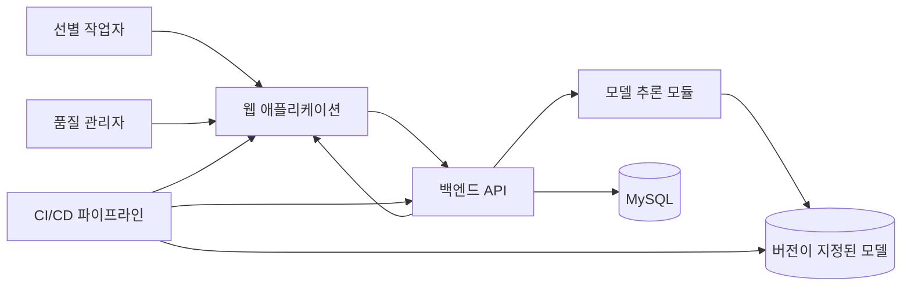
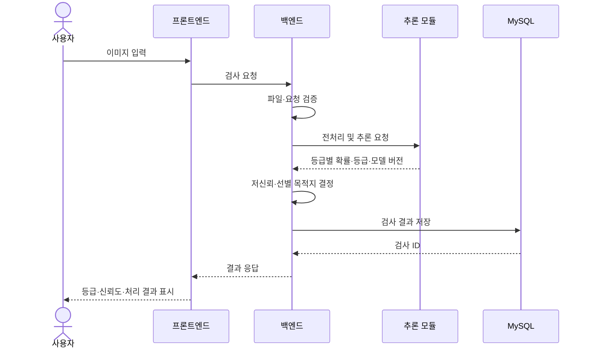
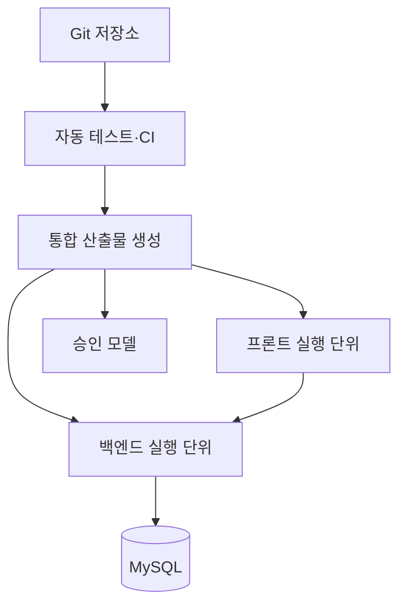

# CQC 아키텍처

## 1. 목적과 범위

CQC는 농산물 이미지를 받아 품질 등급을 예측하고, 저신뢰 검수 여부와 선별 목적지를 결정하여 MySQL에 검사 이력을 저장한다. 웹은 개별 검사 결과, 검사 이력과 통계·분석 정보를 제공한다.

현재 필수 데이터 범위는 사과 품종 2종이다. 두 번째 농산물 품목과 물리 장비 연동은 통합 검증 후 결정한다.

## 2. 아키텍처 원칙

1. 학습과 서비스 추론은 같은 전처리 모듈을 사용한다.
2. 프론트엔드는 모델을 직접 호출하지 않고 백엔드 API를 사용한다.
3. 백엔드는 모델 출력에 판정 정책을 적용하고 MySQL 저장을 책임진다.
4. 모델·API·DB 계약을 문서로 먼저 합의하여 네 역할이 병렬로 작업한다.
5. 기술 스택이 확정되지 않은 영역은 논리 구성으로 정의하고 제품을 임의로 지정하지 않는다.
6. 원본 데이터, 비밀값과 대용량 모델 파일을 Git에 직접 저장하지 않는다.

## 3. 시스템 컨텍스트



## 4. 전체 처리 흐름

### 4.1 학습 흐름

```text
AI Hub 원본 이미지·라벨
  → 파일·라벨 무결성 검사
  → 사과 품종 2종 필터링
  → 동일 개체·다각도 그룹 확인
  → train·validation·test 분할
  → 전처리·증강
  → 기준선·후보 모델 학습
  → Macro F1·등급별 지표·혼동행렬 평가
  → 승인 모델과 전처리 설정 저장
```

### 4.2 온라인 검사 흐름



### 4.3 이력·통계 조회 흐름

```text
웹 조회 조건
  → 백엔드 요청 검증
  → MySQL 이력 검색 또는 집계
  → 페이지·통계 응답
  → 웹 표·그래프 표시
```

## 5. 논리 구성 요소

| 구성 요소 | 책임 | 담당 | 입력 | 출력 |
|---|---|---|---|---|
| 데이터 검사·가공 | 파일·라벨 검사, 정규화, 분할 | 조현재 | AI Hub 원본 | 매니페스트와 분할 목록 |
| 학습 파이프라인 | 모델 학습·평가·선정 | 조현재 | 학습 데이터 | 모델, 설정, 평가 보고서 |
| 추론 모듈 | 동일 전처리와 등급 확률 반환 | 조현재 | 이미지 | 모델 예측 계약 |
| 웹 애플리케이션 | 검사 입력, 결과·이력·통계 표시 | 강성민 | 사용자 입력·API 응답 | 사용자 화면 |
| 백엔드 API | 입력 검증, 모델 호출, 정책, 조회 | 홍준희 | 웹 요청·모델 출력 | 검사·이력·통계 응답 |
| 판정 정책 | 저신뢰 여부와 선별 목적지 결정 | 홍준희·조현재 | 등급별 확률 | 등급 목적지 또는 REVIEW |
| MySQL | 검사 이력 저장과 집계 | 홍준희 | 검사 결과 | 이력·통계 데이터 |
| 자동 테스트·배포 | 품질 검사, 컨테이너, 배포 | 홍유나 | 코드·모델·설정 | 검증된 통합 버전 |

## 6. 역할별 경계와 소유권

| 영역 | 소유자 | 소유 범위 | 협의 대상 |
|---|---|---|---|
| 데이터·모델 | 조현재 | 데이터 매핑, 분할, 학습, 평가, 전처리·추론 모듈 | 홍준희, 홍유나 |
| 프론트엔드 | 강성민 | 검사·결과·이력·통계 화면과 API 클라이언트 | 홍준희 |
| 백엔드 | 홍준희 | API, 판정 정책, MySQL 구조·연동·조회 | 조현재, 강성민, 홍유나 |
| MLOps·CI/CD | 홍유나 | 실행 환경, 자동 테스트, 모델 버전, 통합 배포 | 전체 |

## 7. 인터페이스 계약

### 7.1 모델 → 백엔드

필수 정보:

- 품목
- 필요 시 품종
- 특·상·보통 확률
- 예측 등급
- 신뢰도
- 모델 버전

조현재는 입력 크기, 색상 공간, 정규화, 클래스 순서와 오류 조건을 함께 제공한다. 홍준희는 이 모듈을 변경하지 않고 호출할 수 있도록 어댑터를 작성한다.

### 7.2 백엔드 → 프론트엔드

기능 단위:

- 검사 요청과 결과
- 검사 이력 검색
- 통계·분석 집계
- 서비스 상태

응답은 정상, 입력 오류, 추론 실패, DB 실패와 저신뢰 상태를 구분한다. 상세 경로와 스키마는 홍준희가 문서화하고 강성민이 검토한다.

### 7.3 백엔드 → MySQL

- 검사 ID와 처리 시각
- 품목·품종
- 예측 등급과 신뢰도
- 검수 여부와 선별 목적지
- 모델 버전
- 처리 상태와 오류 정보

물리 테이블과 인덱스는 이 문서에서 확정하지 않는다. 홍준희의 DB 설계 문서를 단일 기준으로 사용한다.

## 8. 데이터 저장

| 데이터 | 위치 | Git 포함 | 보존 목적 |
|---|---|---|---|
| AI Hub 원본 | `data/raw/` | 제외 | 원본 보존 |
| 가공 데이터 | `data/processed/` | 대용량 제외 | 재현 가능한 학습 입력 |
| 분할·설정 | `configs/` 또는 담당자가 정한 경로 | 경량 파일 포함 가능 | 학습 재현 |
| 모델 | `models/` 또는 모델 저장 위치 | 제외 | 서비스 추론 |
| 평가 결과 | `outputs/` | 선별 포함 | 모델 승인 근거 |
| 검사 이력 | MySQL | 해당 없음 | 이력·통계·분석 |

## 9. 배포 논리 구조



배포 환경, 컨테이너 도구와 CI/CD 제품은 홍유나가 팀 환경을 확인한 뒤 확정한다. MySQL 마이그레이션은 백엔드 실행 전에 재현 가능하게 적용되어야 한다.

## 10. 오류 처리

| 오류 | 처리 주체 | 기대 동작 |
|---|---|---|
| 지원하지 않는 파일 | 백엔드 | 추론 없이 입력 오류 반환 |
| 손상 이미지 | 백엔드·추론 | 원인을 구분해 오류 반환 |
| 모델 파일 누락 | 추론·MLOps | 서비스 상태 실패와 로그 기록 |
| 낮은 신뢰도 | 판정 정책 | 실패가 아닌 REVIEW 결과로 저장 |
| MySQL 연결 실패 | 백엔드 | 저장 실패를 숨기지 않고 오류 처리 |
| 통계 쿼리 실패 | 백엔드 | 오류 응답과 로그 기록 |
| 프론트 API 실패 | 프론트엔드 | 재시도 또는 사용자 오류 안내 |

검사 결과 저장과 API 응답의 일관성을 어떻게 보장할지는 DB 설계와 백엔드 트랜잭션 정책에서 확정한다.

## 11. 관측과 검증

- 요청 ID 또는 검사 ID로 프론트·백엔드·DB 기록을 추적한다.
- 로그에 실제 DB 비밀번호와 민감한 경로를 남기지 않는다.
- 모델 버전과 처리 시간을 검사 이력에 연결한다.
- 상태 확인 기능은 API 실행, 모델 로딩과 DB 연결 상태를 구분한다.
- CI는 데이터 검사, 모델 로딩, API, DB 마이그레이션과 핵심 통합 시험을 실행한다.

## 12. 보안 원칙

- MySQL 비밀번호와 접속 정보는 환경 변수 또는 비밀 관리로 주입한다.
- `.env`와 실제 비밀값을 Git에 커밋하지 않는다.
- 업로드 파일명만 믿고 저장 경로를 만들지 않는다.
- 파일 크기와 형식을 제한한다.
- 사용자 인증은 현재 미확정이며 외부 공개 범위가 정해지면 별도 설계한다.

## 13. 미결정 사항

| 항목 | 담당 | 결정 기준 |
|---|---|---|
| 모델·이미지 프레임워크 | 조현재 | GPU·팀 환경·기준선 속도 |
| 프론트엔드 프레임워크 | 강성민 | 1개월 구현성과 시각화 요구 |
| 백엔드 프레임워크 | 홍준희 | 이미지 업로드·모델 연동·문서화 |
| MySQL 물리 스키마 | 홍준희 | 이력·통계 쿼리와 무결성 요구 |
| 마이그레이션 도구 | 홍준희·홍유나 | 재현성과 배포 환경 |
| CI/CD·컨테이너 도구 | 홍유나 | 팀 PC와 배포 환경 |
| 이미지 보관 방식 | 홍준희 | 용량·보안·시연 요구 |
| 인증·권한 | 전체 | 외부 공개와 사용자 구분 필요성 |
| 물리 장비 연동 | 전체 | 장비 확보와 안전 요구 |
