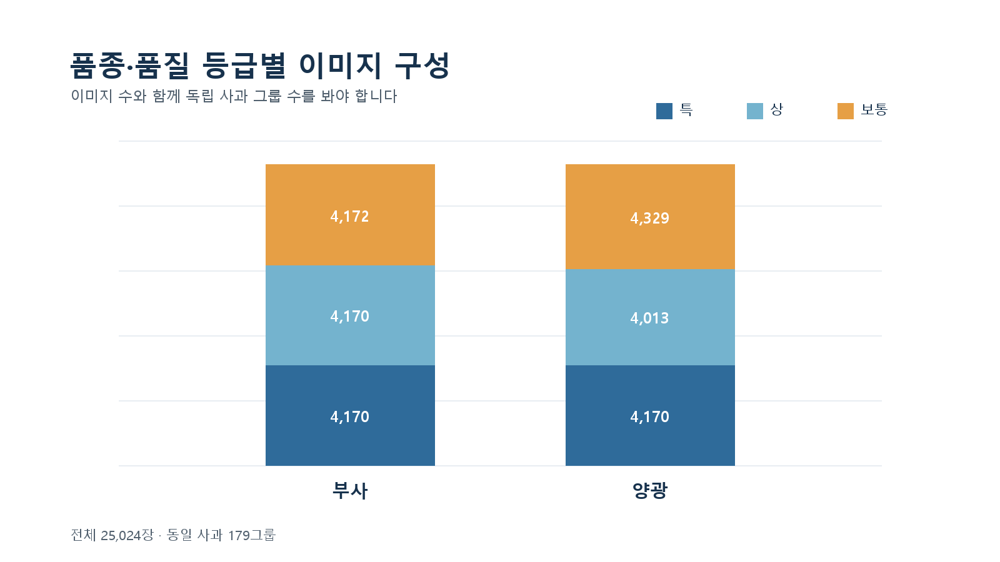
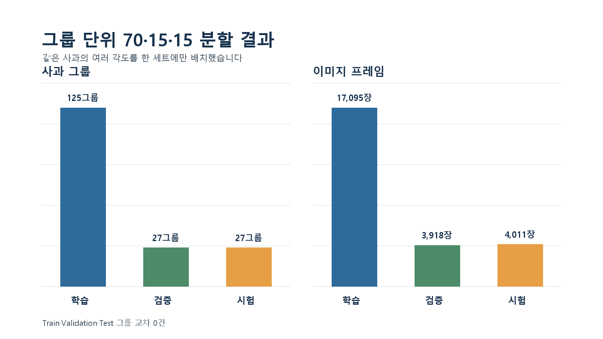
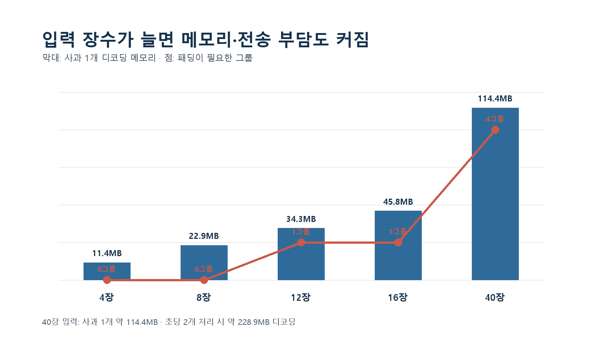

# 공개 데이터 기반 사과 품질 자동 선별 문제 정의

중간 점검 · 2026.09.17 15:00

CQC 팀 프로젝트

---

## 1. 현실에서 확인한 문제

- 산지유통센터는 인력 부족과 육안 판정 편차를 동시에 겪고 있다.
- 성주 월항농협은 사과가 아닌 참외 사례지만, AI 영상 선별과 로봇 적재를 실제 공정에 도입했다.
- 참외 한 알을 360도 회전시키며 24장을 촬영하고 26가지 외관 상태를 확인한다.
- 도입 후 하루 처리량은 80톤에서 120~160톤으로 증가했고 작업 인력은 50% 이상 감소했다.
- 촬영 이미지와 판정 데이터를 남겨 농가가 등급 결과를 확인할 수 있게 했다.

> 실제 구축 사례와 대시보드 사진: [전자신문, 「인력 절반 줄이고 처리량 최대 2배…산지유통 판 바꾼다」](https://m.etnews.com/20260817000069?SNS=00004&utm_source=chatgpt.com)

출처: 전자신문, 2026.08.17

---

## 2. 우리가 정의한 문제

### 문제 문장

사과 선별 작업에서 동일한 기준으로 품종과 외관 품질을 판정하고, 낮은 신뢰도와 처리 지연을 안전하게 재검사로 보내는 데이터 기반 자동 선별 흐름이 필요하다.

### 프로젝트 범위

- 대상: 부사·양광 2개 품종
- 품질 등급: 특·상·보통
- 입력 단위: 동일 사과의 다각도 이미지 묶음
- 출력: 품종·등급·신뢰도·선별 목적지
- 시연: 실제 설비 대신 시뮬레이터와 가상 선별 bin 사용

### 이번 프로젝트에서 다루지 않는 것

- 실제 카메라·PLC·로봇 연동
- 당도·맛·내부 손상 판정
- 실제 유통 등급 인증과 가격 결정

---

## 3. 공개 데이터 수집과 검증

- 출처: [AI Hub 농산물 품질(QC) 이미지](https://aihub.or.kr/aihubdata/data/view.do?aihubDataSe=data&dataSetSn=149&topMenu=103)
- 로컬 확보: 이미지·JSON 25,024쌍
- 품종: 부사·양광
- 등급: 특·상·보통
- 동일 사과 그룹: 179개
- 원본 이미지: 1000×1000 PNG

### 데이터 품질 확인 결과

- 이미지와 JSON 연결 누락 0건
- 손상 이미지 0건
- 이미지와 라벨의 품종·등급 불일치 0건
- 완전 중복 후보 5쌍은 자동 삭제하지 않고 검토 대상으로 보존
- 동일 사과를 여러 각도에서 촬영한 구조를 확인

---

## 4. 품종·등급별 데이터 구성

### 관찰

- 전체 25,024장은 179개의 사과 그룹으로 구성된다.
- 양광 ‘상’ 그룹이 다른 조합보다 많아 그룹 수 불균형이 있다.
- 이미지 수가 많아 보여도 실제 독립 표본은 사과 179개이므로, 성능 해석은 이미지 수가 아닌 그룹 수를 기준으로 해야 한다.

---

## 5. 데이터 누수 없는 분할

- 학습 125그룹, 검증 27그룹, 시험 27그룹
- 실제 비율: 69.83% · 15.08% · 15.08%
- 동일 사과의 다각도 이미지를 하나의 세트에만 배치
- Train·Validation·Test 그룹 교차 0건
- 시험 세트는 모델 구조, 입력 장수, 임계값 선택에 사용하지 않는다.

### 의미

이미지 단위로 무작위 분할하면 같은 사과의 다른 각도가 학습과 시험에 동시에 들어갈 수 있다. 그룹 단위 분할은 이런 데이터 누수를 막고 실제 새 사과에 대한 성능을 측정한다.

---

## 6. 다각도 입력의 선택 문제

- 4장과 8장은 모든 179그룹에서 패딩 없이 구성할 수 있다.
- 40장 입력은 4그룹에 패딩이 필요하고 총 85개 슬롯이 빈다.
- 40장을 비압축 RGB로 읽으면 사과 1개당 약 114.4MB다.
- 초당 사과 2개를 처리하면 디코딩 이미지가 초당 약 228.9MB 발생한다.

### 분석 질문

입력 장수를 늘려 얻는 정확도 향상이 CPU 추론시간, 메모리 복사, HTTP 전송 비용을 정당화하는가?

---

## 7. 데이터에서 도출한 주장과 가설

### 주장 1 · 다각도 정보가 품질 판정에 필요하다

한 방향에서 보이지 않는 외관 결함이 다른 각도에서 드러날 수 있다. 실제 스마트 APC도 한 개체를 회전시키며 여러 장을 촬영한다.

**가설 H1**

단일 이미지보다 다각도 이미지 결합 모델의 그룹 단위 Macro F1이 높을 것이다.

### 주장 2 · 많은 입력 장수가 항상 최선은 아니다

입력 장수가 늘면 정보량과 함께 CPU·메모리 부담도 증가한다.

**가설 H2**

8~16장 입력이 40장과 유사한 성능을 유지하면서 500ms 처리 목표에 더 적합할 것이다.

### 주장 3 · 신뢰도 기반 재검사가 필요하다

자동 선별이 불확실한 결과까지 강제로 분류하면 오선별 위험이 커진다.

**가설 H3**
검증 데이터에서 정한 신뢰도 임계값을 적용하면 일부를 재검사로 보내는 대신 자동 처리 구간의 오류율을 낮출 수 있다.

---

## 8. 검증 계획

### 모델·데이터 실험

| 검증 항목 | 비교 | 지표 |
|---|---|---|
| 다각도 효과 | 단일 이미지 vs 그룹 결합 | 그룹 단위 Macro F1 |
| 입력 장수 | 4·8·12·16·40장 | Macro F1, 평균·p95 추론시간 |
| 모델 구조 | 경량 CNN 기준선과 후보 모델 | 품종·등급별 Precision·Recall·F1 |
| 재검사 정책 | 신뢰도 임계값별 비교 | 자동 처리율, 자동 처리 오류율 |

### 시스템 검증

- CPU 환경에서 사과 그룹 초당 2개 처리
- 그룹당 모델 처리 500ms 목표
- 시간 초과·모델 오류·DB 오류를 재검사 흐름으로 분리
- 대시보드에서 처리량, 등급 분포, 재검사율, 지연시간 확인
